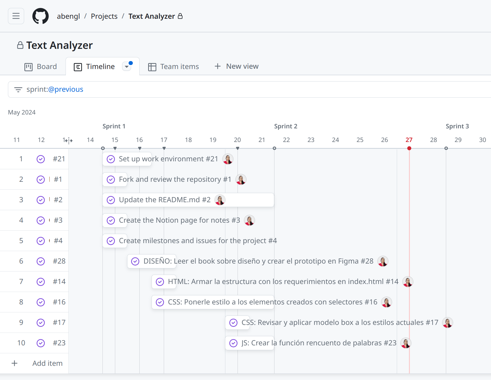
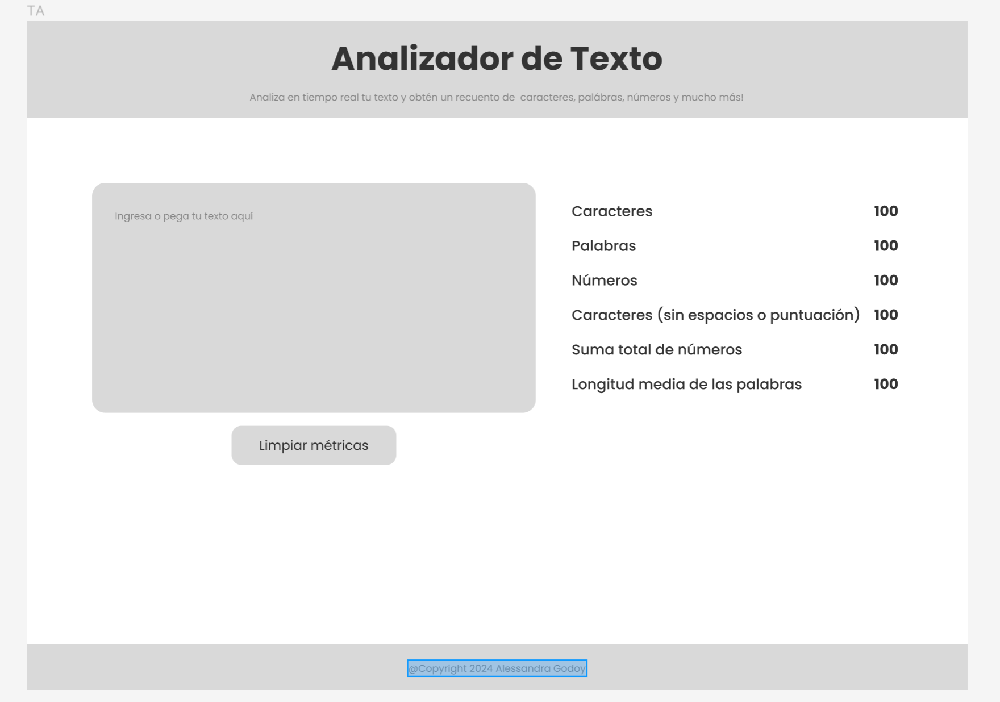

# Analizador de texto

## Índice

* [1. Consideraciones generales](#1-consideraciones-generales)
* [2. Contexto](#2-contexto)
* [3. Resumen del proyecto](#3-resumen-del-proyecto)
* [4. Funcionalidades](#4-funcionalidades)
* [5. Desarrollo](#5-desarrollo)

***

## 1. Consideraciones generales

- **Proyecto**: individual.
- **Tiempo estimado**: 2 a 4 Sprints.
- **Tecnologías**: HTML, CSS y JavaScript (vanilla).
- **Aprendizaje**: [Notion](https://buttered-accordion-f01.notion.site/P1-Analizador-de-Textos-2366ec2287024ae397bbb358ecafc50e?pvs=4).
- **Prototipo**: [Figma](https://www.figma.com/design/Ta7gMoQJfuiPvfCvKBipFS/Text-Analyzer?node-id=0-1&t=GmOdad4uQQkZBP1e-1).

## 2. Contexto

Un analizador de texto es una aplicación para extraer información útil de un
texto utilizando diversas técnicas (NLP, ML, estadística) para generar métricas sobre los textos que pueden ayudar a las usuarias a
tomar decisiones informadas y sacar conclusiones significativas.

## 3. Resumen del proyecto

En este proyecto se desarrolla una aplicación web que servirá para que la usuaria
pueda analizar un texto en el navegador mostrando una serie de indicadores y
métricas específicas sobre caracteres, letras, números, etc. Que hayan sido
enviadas como _input_ por ella. 

## 4. Funcionalidades

El listado de funcionalidades es el siguiente:

1. La aplicación debe permitir a la usuaria ingresar un texto escribiéndolo
en un cuadro de texto.

2. La aplicación debe calcular las siguientes métricas y actualizar el
resultado en tiempo real a medida que la usuaria escribe su texto:

    - **Recuento de palabras**
    - **Recuento de caracteres (incluye signos de puntuación y espacios)**
    - **Recuento de caracteres excluyendo espacios y signos de puntuación**
    - **Recuento de números**
    - **Suma total de números**
    - **Longitud media de las palabras**

3. La aplicación debe permitir limpiar el contenido de la caja de texto haciendo
clic en un botón.

## 5. Desarrollo

### Sprint 1
Durante este sprint busqué establecer la estructura básica de la web y desarrollar las funciones de conteo de palabras y carácteres. 
Esta es una <i>línea de tiempo</i> de las tareas:
<figure>
  
  <figcaption><i>Sprint 1 en Github Projects</i></figcaption>
</figure>

* **Diseño**

  - Inicié elaborando un <i>prototipo inicial (wireframe)</i> en Figma basado en los requerimientos del projecto:

  - Para generar una mejor experiencia a la usuaria, pusé énfasis en el input y separé las métricas en una columna lateral. 
* **HTML**
  - 